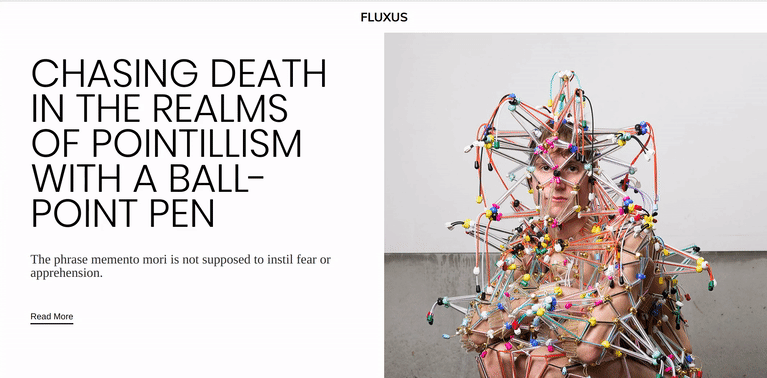

### image Reveal Portfolio test

MINI PORTFOLIO TEST to apply the precedent project (image reveal)

### WARNING!!

There is an issue or something i am not sure in terms of css styles, i dont know if it can cause some problems in the website (it seems to work pretty well). I will write a note in those lines after i get a feedback from my teacher.  line 8-9 and 58-59

~~No copyright infringement intended, All pictures used in this exercise are **_only_** for educational purposes.~~

#### Web design by Nadia Mariduena

#### images by MetalMagazine

#### Artist: Tom Van der Borght

##### Portrait and photos: Kaat Pype
